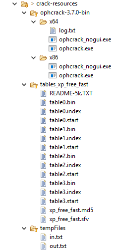

# COS 375: Hash-Cracker
## Teddy Jandro

See [hash-rest](./hash-rest) for the serverside Spring RESTful web service and [hash-cracker-app](./hash-cracker-app) for the clientside Angular web application.

### Current State

As of now, I have fully implemented the Rest API with Spring backed by a MySQL database. I have also implemented a web app in Angular which accesses this API. The driving goal of this project was to create an API which can be used as a lookup for password based on their hash value. I implemented this using the LM Hash which was used by certain Windows Network OS's. I chose this because I had some knowledge about it and I knew that cracking these hashes would be fairly simple computationally. 

The Angular web app provides a user interface where you can either provide a password's plaintext and get the LM Hash of that password, or provide the LM Hash and get the plaintext of the password. Because the Rest API persists records of all requests made, the app also shows some metadata which is associated with the returned password.

The Rest API allows for the following requests:
* GET /secrets
	* Returns all secrets in the database
* GET /secrets/{plaintext}
	* Returns the secret with given plaintext
* GET /hashes/{hash}
	* Returns the secret with the given hash
* DELETE /secrets/{plaintext}
	* Deletes the secret with given plaintext from the database
* POST /secrets/{plaintext}
	* Adds the secret with given plaintext to the database

Internally the Spring program persists all newly created passwords and tracks some metadata: when the hash was found, how many times it has been requested, how long it took to crack (usually 0 if the hash was generated by the program). When a password is requested either by hash value or plaintext, the database is checked. 
If the password does not exist in the database it is created and persisted. If the user provided the plaintext then the hash value is generated using the LM hash algorithm which I implemented myself with some help from tutorials. If the user provided the hash value instead, then the program calls an external hash cracking software, Ophcrack, in order to find the plaintext. The rainbow table I'm using with Ophcrack only works on alphanumeric password, but it is claimed to have 99.9% success. See my instructions below to ensure that that Ophcrack is installed correctly or else this feature won't work.

See [output](./output) for screen shots of the REST API, the MySQL tables backing the REST API, and the Angular front-end.

### How to Run

#### Setting up MySQL
Start a MySQL instance on port 3306 and create a schema named “db_hash”. Create a user for said instance with username “springuser” and password “cracker” and full priveledges for that schema. Tables will be added automatically to the schema, so this is enough configuration for Spring program to run. If you wish to change any of these values, you can find the configurations in the file at 
	[COS-375-Hash-Cracker/hash-rest/src/main/resources/application.properties](./hash-rest/src/main/resources/application.properties)

#### Installing Ophcrack
In order to provide actually cracking of hashes, you need to install the program Ophcrack and some rainbow tables. Ophcrack can be downloaded [here](http://ophcrack.sourceforge.net/download.php?type=ophcrack) by selecting the appropriate version for your operating system. Note that I have only tested my program using the Windows version.


The required rainbow tables can be downloaded [here](http://ophcrack.sourceforge.net/tables.php) by selecting the table labeled “XP free fast”


Copy both of the .zip archives downloaded into [COS-375-Hash-Cracker/hash-rest/crack-resources](./hash-rest/crack-resources). Now unzip “ophcrack-3.7.0-bin.zip” in this directory and create a directory named “tables_xp_free_fast” and unzip “tables_xp_free_fast.zip” there. 

Lastly in the crack-resources directory create a directory named “tempFiles”. The screenshot below shows the correct directory structure. Note that the files “log.txt”, “in.txt”, and “out.txt” are not required, they were created by the Spring application.



#### Running the Spring Application
You can run the Spring app either within Spring Tool Suite by importing and running it as a Spring application, or alternatively by using the following Maven command in the project directory named “hash-rest”
````
    mvn spring-boot:run
````
#### Running the Angular Web App
Assuming you have Angular CLI installed, just run the following commands in the project directory named “hash-cracker-app”.
````
    npm install // Installs all necessary Node Modules
    npm start	// Runs the start script specified in package.json
````
Now just navigate to localhost:4242/ in a web-browser and the app should be running.

### Original Project Proposition: 

  For my project I would like to extend a previous project I did for the Ethics of Computing class. For that project, I attempted my first web application: a brute force password cracker that runs totally in browser. It tries to randomly guess plaintext passwords to crack an LM Hash, which is known to be the easiest password hashing scheme to crack. 
  I successfully completed the project, but the solution was very inelegant and inefficient, not to mention ugly. It's actually still running at cs.usm.maine.edu/~jandro so you can see how far I got. It's written completely by hand in JavaScript and basic HTML. I have a pretty good discussion of what could be improved about the password cracker itself functionally, but I also think it would be interesting to take the opportunity in this class to make it more visually appealing via Angular, as well as more efficient via REST.
  In my discussion I talk about efficiency concerns, one of which is to have persistency of a map of previously checked plaintext to the  hashes themselves. This could easily be implemented with a REST API. 
  
User Stories:
  As a user, I can provide a hash with a known encryption scheme so that I can recover the plaintext password associated with it.
	
  As a user, I can provide a hash with its known plaintext so that the collection of known hashes can be expanded
	
  As a user, I can provice a hash with an unknown encryption scheme so that I can recover the plaintext password associated with it.

Server Data:
  The server attached to the Angular project will provide a REST API which will be responsible for doing the heavy-lifting of the hash cracking. From the Angular client's perspective the REST API will simply provide a plaintext password as a response to a request containing a hash. Some metadata will also be transferred, for example: when the hash was generated, how quickly it was found in the database, how many times it has been requested, etc. On the actual backend I plan to have the server maintain some persistent map of hash, plaintext pairs. This map will grow with time, based on users either providing it (through user story 2) or by it being generated. 
  If time permits I would like to support multiple different hashing algorithms which are available, but to start I will limit it to the LM Hashing algorithm. The mechanisms of the map is another hurdle I will need to overcome. I can most easily implement a simple lookup table, but after some research I've found that rainbow tables provide better memory conservation at the cost of computation time. 
